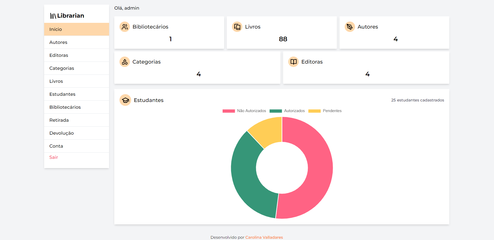

 <div align="center">
    
    <h2>Sobre o projeto</h2>
    
</div>

O Librarian é um sistema de gerenciamento de biblioteca onde usuários podem visualizar, cadastrar e editar livros, autores, editoras e categorias. Além de poder gerenciar os estudantes cadastrados na plataforma.

Este projeto foi desenvolvido para a matéria de Desenvolvimento Web do curso de Análise e Desenvolvimento de Sistemas.



## Pré-requisitos

-   NodeJs
-   PHP

## :wrench: Instalação

1. Crie um arquivo **database.sqlite** na pasta **database**.
2. Rode o comando:

```sh
    npm install
```

3. Rode o comando:

```sh
    npm run setup
```

Depois de seguir esses passos o projeto está configurado. Para executar o projeto rode o comando:

```sh
    npm run start
```

O projeto estará rodando em **localhost:8000**.

## :hammer_and_wrench: Construído com

-   [](https://laravel.com/)
-   [](https://tailwindcss.com/)
-   [](https://vitejs.dev/)
-   [](https://www.sqlite.org/index.html)
-   [](https://www.chartjs.org/)
